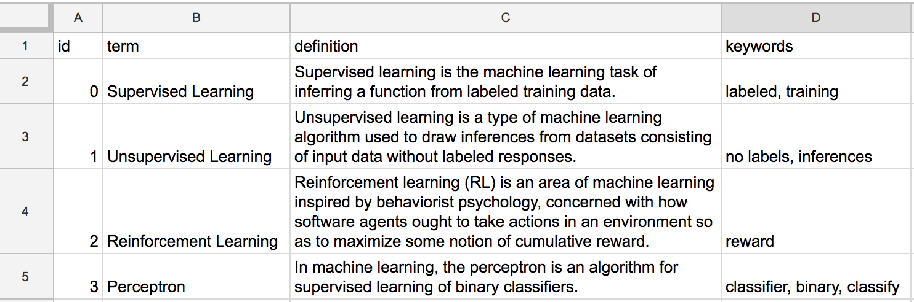

# Connecting a Database Using Google Sheets

## 1. Prepare a Google Sheet as Your Database

You can use a Google Sheet as a database for your chatbot. Making a database this way allows you to more easily offer a lot of information for your users. For example, you could create a dictionary of terms on a topic that your chatbot would use to help people searching for information.

Below is an example of a spreadsheet of _machine learning_ terms. Of course, you could have many more terms. **The key is to make it a simple table with single word headings on the first row.**




**Update February 11, 2022:** Steps 2 and 3 below have been updated to fix a problem associated with a Google api change.


## 2. Publish Your Google Sheet <a href="#using-google-sheet-as-database-recommended" id="using-google-sheet-as-database-recommended"></a>

In order to import your information, you will need to publish your Google Sheet.

1. Publish your copy of the spreadsheet by ...
   * Selecting `File > Share > Publish to the web...`&#x20;
   * Then under the `link` heading select the sheet you want to use with the first drop-down menu
   * Select `comma-separated values (.csv)` from the second drop-down menu.&#x20;
   * Finally, click the `Publish` button and copy the link provided.
2. Once your spreadsheet is published, **copy the shareable link**. (Make sure your link is not restricted to your organization.)

## 3. Load the Spreadsheet Data into Your Chatbot JavaScript

Update the `code.js` file inside the `setup()` function to what you see in lines 4 - 7 below. Notice that `chatbot.loadFiles(['bot.rive']);` has been moved inside the `chatbot.getDB` function. This ensures that your database has loaded before the chatbot is started.

```javascript
function setup() {
	pop = new Audio('pop.mp3');
  chatbot.replyDelay = 500;
  chatbot.getDB('https://docs.google.com/spreadsheets/d/e/2PACX-1vQVGvNvFcTxeu2zL1u8xSicbmD7Vghr_gjBp-lhAXscGi0nzy9RX7ZU0Hp0GvQgPP0cpgSeyBbUa8_Y/pub?gid=0&single=true&output=csv').then(data => {
    chatbot.db = data;
    chatbot.loadFiles(['bot.rive']);
  });
}
```

**You will need to change the link above to the link you copied in the previous step for your Google sheet.** Your spreadsheet data is now available in an array, `chatbot.db`, where each array element represents a row in your spreadsheet as an object.


**For those that may have previously used `loadDB( )`:**&#x20;

The `loadDB( )` function still works but it is being deprecated. You should use the `getDB( )` shown above since it supports loading multiple databases.


The `chatbot.db` array now contains your spreadsheet data as a list of Javascript objects like the one shown below. See the connection to the spreadsheet we started with? So, in Javascript you could use `chatbot.db[0].keywords` to get the first term's key words ("labeled, training").

```javascript
[
  {
    id: "0",
    term: "Supervised Learning",
    definition:
      "Supervised learning is the machine learning task of inferring a function from labeled training data.",
    keywords: "labeled, training"
  },
  {
    id: "1",
    term: "Unsupervised Learning",
    definition:
      "Unsupervised learning is a type of machine learning algorithm used to draw inferences from datasets consisting of input data without labeled responses.",
    keywords: "no labels, inferences"
  },
  {
    id: "2",
    term: "Reinforcement Learning",
    definition:
      "Reinforcement learning (RL) is an area of machine learning inspired by behaviorist psychology, concerned with how software agents ought to take actions in an environment so as to maximize some notion of cumulative reward. ",
    keywords: "reward"
  },
  {
    id: "3",
    term: "Perceptron",
    definition:
      "In machine learning, the perceptron is an algorithm for supervised learning of binary classifiers.",
    keywords: "classifier, binary, classify"
  }
]
```

## 4. Accessing the Database in a Function&#x20;

You could now access your database in a function like the one below. This function gets a random term to quiz the chatbot user. Notice how the chatbot responds to "quiz me" by calling the `getRandomTerm` function (object) which returns a random term so the chatbot responds with something like "What is Reinforcement Learning?".

```
  > object getRandomTerm javascript
    var randomIndex = Math.floor(Math.random() * chatbot.db.length);
    var currentItem = chatbot.db[randomIndex]
    return currentItem.term;
  < object

  + quiz me
  - What is <call>getRandomTerm</call>?
```

Wow. That's seems like a lot of work for such a short dialogue. But now you could have one of 10,000 terms randomly displayed to the user. There will be more examples of functions accessing a database in the listed _Code Mods_.

## 5. Using multiple databases

#### Separate Google Sheets Files

If you want to access multiple Google Sheet files to create multiple databases, you can reuse the `getDB( )` function to load several databases like below. This allows you to access each database with `chatbot.db`, `chatbot.db2`,  and `chatbot.db3`.

```javascript
// replace the 'link' text in each to match your spreadsheet links 
// for each Google Sheets file
chatbot.getDB('link').then(data => chatbot.db = data);
chatbot.getDB('link2').then(data => chatbot.db2 = data);
chatbot.getDB('link3').then(data => chatbot.db3 = data);
```

#### One Google Sheets File with Several Sheets

If you want to use a single Google Sheets File that has multiple named sheets, you can use the `getDB( )` function in the following way. Notice that you must include the _sheet name_ along with the _link_ in this case.

```javascript
// replace the 'link' text and 'sheet name' in each to match your spreadsheet link
// and corresponding sheet names 
chatbot.getDB('link', 'My First Sheet Name').then(data => chatbot.db = data);
chatbot.getDB('link2', 'My Second Sheet Name').then(data => chatbot.db2 = data);
chatbot.getDB('link3', 'My Third Sheet Name').then(data => chatbot.db3 = data);
```
