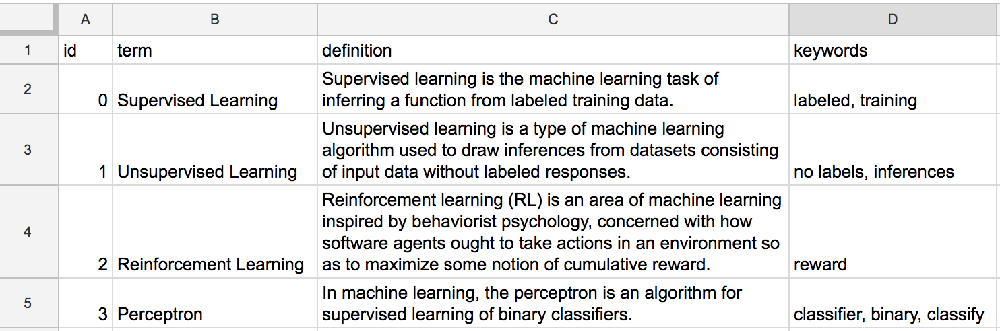

# Connecting a Database Using Google Sheets

## 1. Prepare a Google Sheet as Your Database

You can use a Google Sheet as a database for your chatbot. Making a database this way allows you to more easily offer a lot of information for your users. For example, you could create a dictionary of terms on a topic that your chatbot would use to help people searching for information.

Below is an example of a spreadsheet of _machine learning_ terms. Of course, you could have many more terms. **The key is to make it a simple table with single word headings on the first row.**



## 2. Publish Your Google Sheet {#using-google-sheet-as-database-recommended}

In order to import your information, you will need to publish your Google Sheet.

1. Publish your copy of the spreadsheet by selecting `File > Publish to the web...` and click the `Publish` button.
2. Once your spreadsheet is published, click the _share_ button \(upper right-hand side\) of the spreadsheet page and **copy the shareable link**. \(Make sure your link is set to _Anyone with the link can view_.\)

## 3. Load the Spreadsheet Data into Your Chatbot JavaScript

Add the following to your `code.js` file inside the `setup()` function. You can place it at the top.

```javascript
chatbot.loadDB('1rR9ODzcTYv95dYGal-ZXBRp3wgp0I7fbKIk5I2hJkgI');
```

You will need to change the `key` value to the link you copied in the previous step for your Google sheet. Your spreadsheet data is now available in an array, `chatbot.db`, where each array element represents a row in your spreadsheet as an object.

The `chatbot.db` array now contains your spreadsheet data as a list of Javascript objects like the one shown below. See the connection to the spreadsheet we started with? So, in Javascript you could use `chatbot.db[0].keywords` to get the first term's key words \("labeled, training"\).

```javascript
[
  {
    id: "0",
    term: "Supervised Learning",
    definition:
      "Supervised learning is the machine learning task of inferring a function from labeled training data.",
    keywords: "labeled, training"
  },
  {
    id: "1",
    term: "Unsupervised Learning",
    definition:
      "Unsupervised learning is a type of machine learning algorithm used to draw inferences from datasets consisting of input data without labeled responses.",
    keywords: "no labels, inferences"
  },
  {
    id: "2",
    term: "Reinforcement Learning",
    definition:
      "Reinforcement learning (RL) is an area of machine learning inspired by behaviorist psychology, concerned with how software agents ought to take actions in an environment so as to maximize some notion of cumulative reward. ",
    keywords: "reward"
  },
  {
    id: "3",
    term: "Perceptron",
    definition:
      "In machine learning, the perceptron is an algorithm for supervised learning of binary classifiers.",
    keywords: "classifier, binary, classify"
  }
]
```

## 4. Accessing the Database in a Function 

You could now access your database in a function like the one below. This function gets a random term to quiz the chatbot user. Notice how the chatbot responds to "quiz me" by calling the `getRandomTerm` function \(object\) which returns a random term so the chatbot responds with something like "What is Reinforcement Learning?".

```text
  > object getRandomTerm javascript
    var randomIndex = Math.floor(Math.random() * chatbot.db.length);
    var currentItem = chatbot.db[randomIndex]
    return currentItem.term;
  < object

  + quiz me
  - What is <call>getRandomTerm</call>?
```

Wow. That's seems like a lot of work for such a short dialogue. But now you could have one of 10,000 terms randomly displayed to the user. There will be more examples of functions accessing a database in the listed _Code Mods_.

