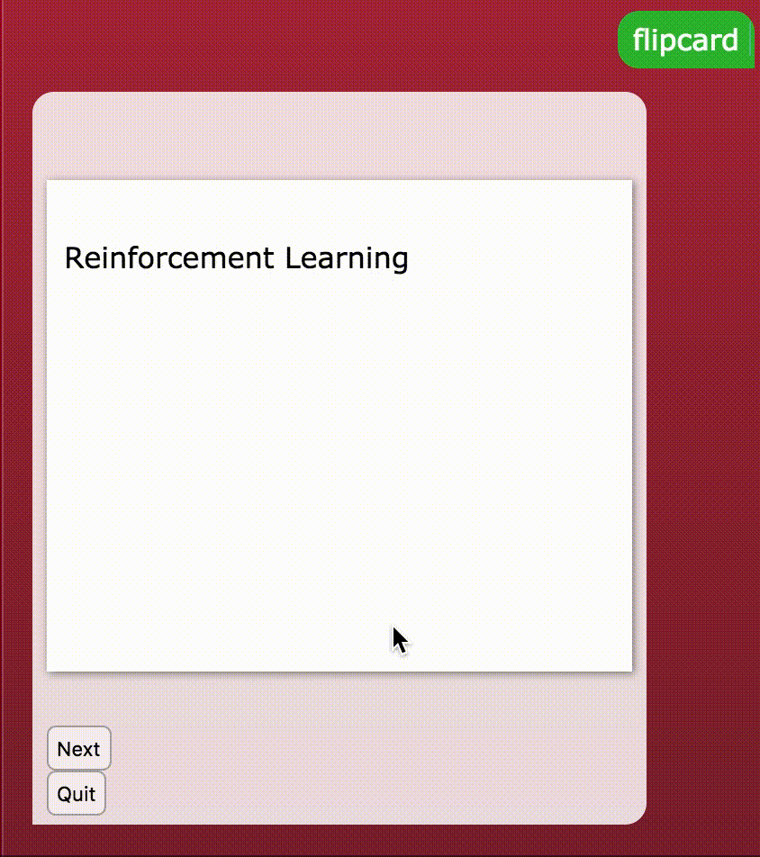

# Create Flipcards



The example code below demonstrates how you could add flip cards to your chatbot. Here we use a flip card to create a study tool for terms and definitions. This example is an adaptation of [a blog post by David Walsh](https://davidwalsh.name/css-flip).

### The Rivescript Object \(Javascript\)

Below, the `getRandomFlipcard` function gets a random term from the database and creates a flash card with the term on the front side and the definition on the back. Buttons for the user to get another term or quit are provided. You can use this code below, but you may need to make adjustments to work with your database column names.

```javascript
> object getRandomFlipcard javascript
  var randomIndex = Math.floor(Math.random() * chatbot.db.length);
  var currentItem = chatbot.db[randomIndex]
  var html =  `
    <div class="flip-container" ontouchstart="this.classList.toggle('hover');">
      <div class="flipper">
        <div class="front">
          ${currentItem.term}
        </div>
        <div class="back">
          ${currentItem.definition}
        </div>
      </div>
    </div>
    <button onclick="chatbot.getReply('flipcard');">Next</button>
    <button onclick="chatbot.getReply('start');">Quit</button>`
  return html;
< object
```

### The Rivescript Trigger

Below is a simple trigger you can use, but you will likely want to customize how the user starts using flip cards, whether by clicking a button or using a different keyword trigger.

```diff
+ flipcard
- <call>getRandomFlipcard</call>
```

### The CSS

You will need the CSS below for the flip card to work. It is recommended that you paste this to the bottom of your stylesheet.

```css
/* For flip card */
/* entire container, keeps perspective */
.flip-container {
	perspective: 1000px;
  margin: auto;
}
	/* flip the pane when hovered */
	.flip-container:active .flipper, .flip-container.hover .flipper {
		transform: rotateY(180deg);
	}

.flip-container, .front, .back {
	width: 325px;
	height: 50vh;
}

/* flip speed goes here */
.flipper {
	transition: 0.6s;
	transform-style: preserve-3d;
	position: relative;
}

/* hide back of pane during swap */
.front, .back {
	backface-visibility: hidden;
  box-sizing: border-box;
  padding: 10px;
  height: calc(50vh - 30px);
  background: white;
  box-shadow: 1px 1px 6px #888;
	position: absolute;
	top: 0;
	left: 0;
}

/* front pane, placed above back */
.front {
	z-index: 2;
	/* for firefox 31 */
	transform: rotateY(0deg);
}

/* back, initially hidden pane */
.back {
	transform: rotateY(180deg);
}
/* End flip card */
```

That's it. Your flip card should work, but you may have to make modifications to how you access your database.

