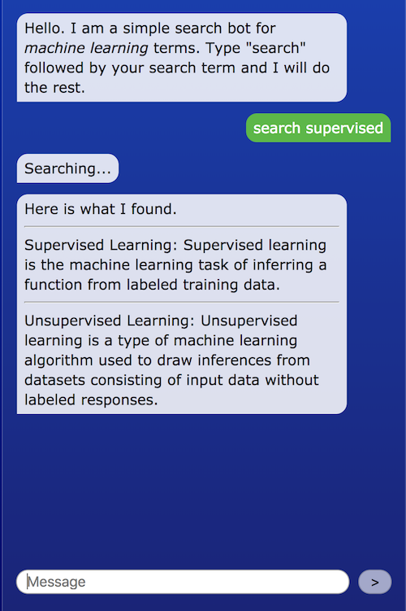

# Searching a Database

Below is an example of how a chatbot could search a database of definitions and display the results as buttons for the user to click to then get the definition of that term.


This example uses the same database described in the example for [Connecting a Database Using Google Sheets](https://docs.idew.org/code-chatbot/code-mods/connecting-a-database-using-google-sheets), which has column names _id, term, definition, and keywords_. Your database will likely have different column names.




## 1. Create the Rivescript Trigger

Create a trigger in your chatbot script like the one below that will respond to the user typing "search" followed by a word. The response will begin with "Searching..." to provide feedback to the user, then call a `searchTerms()` function that we will define next.

```javascript
+ search *
- Searching... <call>searchTerms <star></call>
```

## 2. Create the "searchTerms" Function to Process the Search

The function below will process the search and return HTML about the results.

```javascript
> object searchTerms javascript
  var filtered = chatbot.dbFilter(chatbot.db, "term", args); //used to be args[0]
  var terms = filtered.map(function(row) {
      return `${row.term}: ${row.definition}<hr>`;
    });
  var reply = "Didn't find any matches.";
  if (terms.length) reply = "Here is what I found.<br>" + terms.join(" ");
  chatbot.postReply(reply, 2000);
< object
```

Let's step through what is happening above...

**Line 2** uses the `chatbot.dbFilter()` function. Notice there are 3 arguments used by the function.  
     - `chatbot.db` is the database to be searched.  
     - `"term"` is the column name to be searched. In this case we will search each term name.  
     - `args` represents the text the user has typed in for the search.  
The variable `filtered` now contains the matches of our search.

**Lines 3-5** takes each matched item and creates HTML for the term and definition that will be displayed to the user.

**Line 6** defines a variable for our reply string. We start with "Didn't find any matches" as a default.

**Line 7** modifies our reply with the HTML of terms and definitions if there were any matches.

**Line 8** uses the chatbot.postReply\(\) function to display the reply after 2 seconds.


