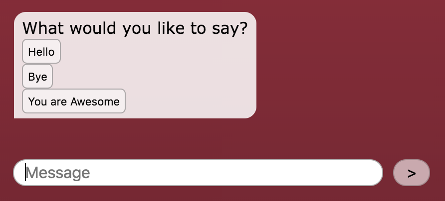

# Add Buttons for User Input



While a text interface is great for allowing people to engage with natural language, there are times when a simple button has advantages allowing you to interact with specificity and save time for the user. 

### Use HTML Buttons Directly in the Rivescript

Below is an example of how you could insert buttons in the chatbot's response. It uses a standard HTML button element with an `onclick` attribute to run the  \`getReply\(\) function of the chatbot library. Notice how each argument in the `getReply` functions \('hello', 'bye', or 'youre awesome'\) is a string that will match a trigger in your Rivescript file.


Notice that the example below uses the continuation syntax \(`^`\) in the chatbot response to make the Rivescript easier to read. Also notice that the optional  `<br>` element is used to create a line break in the chatbot interface.



```diff
+ start
- What would you like to say?<br> 
^ <button onclick="chatbot.getReply('hello')">Hello</button><br>
^ <button onclick="chatbot.getReply('bye')">Bye</button><br>
^ <button onclick="chatbot.getReply('youre awesome')">You are Awesome</button>

+ hello
- Hi.

+ bye
- Bye. Come back soon.

+ youre awesome
- Thanks. You are even more awesome.
```


That's it. Modify as needed.

